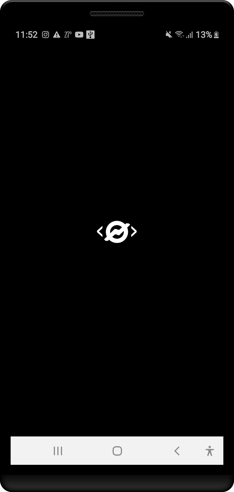
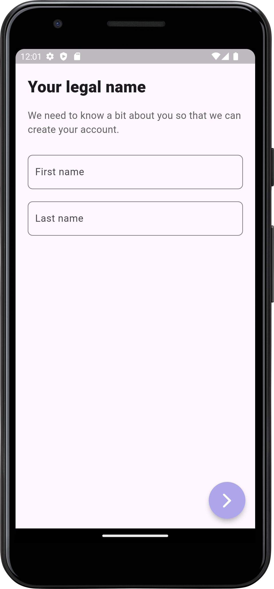
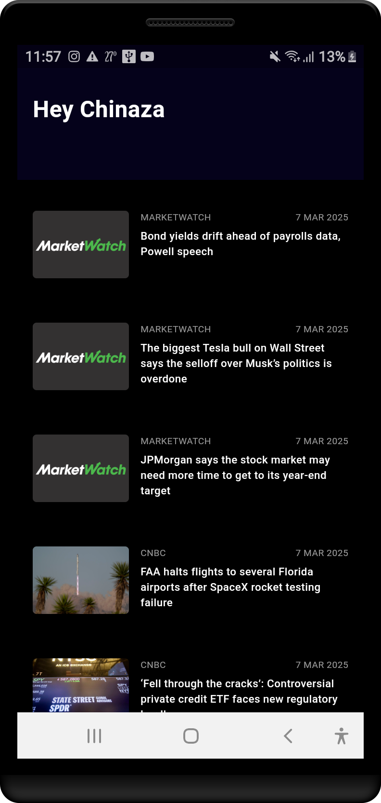

# blott

## Features
- Elegant News Feed: Clean and modern UI displaying news headlines with source information and publish dates
- In-App News Reading: WebView integration allows users to read articles without leaving the app

## Technologies and libraries used
- Flutter for UI development
- GetX for state management
- WebView in-app browser experience for reading articles
- URL Launcher for opening articles in external browsers when needed

## Screenshots
<table>
<tr>
<th></th>
<th></th>
<th></th>
<th></th>
</tr>
<tr>
  <th>Splash Screen</th>
    <th>Sign up screen</th>
    <th>Main Screen</th>
    <th>Detailed news Screen</th>
</tr>
</table>
